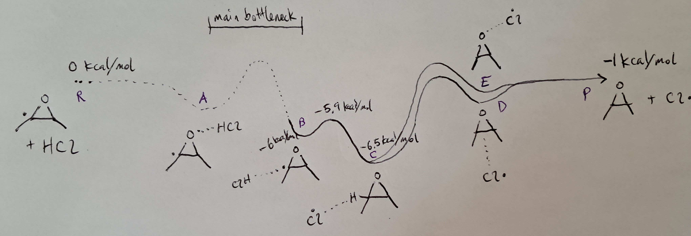

## Context

We are mapping the following PES:

### Complete

We have the following at B2PLYP-D3/cc-pVTZ:
 - The reactants (R)
 - Saddle point A->B
 - Well B (R...HCl) 
 - Saddle point B->C
 - The products (P) 

These we have at wB97X-D/6-31G\*:
 - Well C (RH...Cl)     *(Nick)*
 - Well E (RO...Cl)
 - Saddle point C -> E + reaction path C -> E *(Nick)*

### Running

 - *[Reaction path A->B]*
 - Saddle point C->D (running outside of filesystem)
 - *[Saddle point C->E (running outside of filesystem)]*

(Italics are planned, not yet submitted...)

### Missing

To fill in a complete PES, we would need to run the following at a higher level of
theory:
 - Well C (RH...Cl)
 - Well E (RO...Cl)
 - Saddle point C -> E
